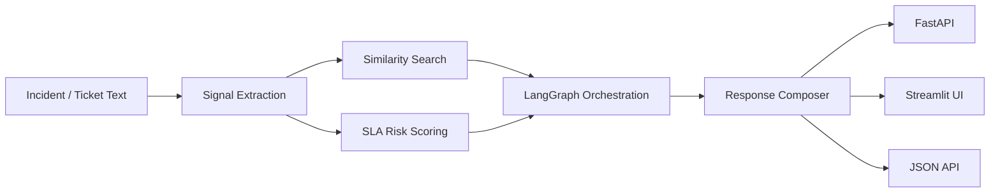

# AI Operations Copilot

An end-to-end enterprise AI demo for incident triage, root-cause reasoning, and next-action recommendations.

The repository is intentionally built to feel like a real internal platform:

- FastAPI backend
- Streamlit front end
- LangGraph orchestration layer
- LangChain-style tools
- Optional local Transformers backend
- Synthetic but realistic telecom / IT operations data
- Tests for the core logic

## Why this project

This is the kind of project that maps directly to your background:

- incident triage
- NOC / ITSM automation
- telecom operations
- root-cause assistance
- SLA risk analysis
- business-friendly action recommendations

It also gives you a strong story on GitHub:

- enterprise value
- agentic AI patterns
- production-style structure
- practical deployment thinking

## What the copilot does

Given an incident, ticket, alarm burst, or noisy operational summary, the system:

1. extracts the likely service, severity, and key signals
2. searches similar incidents and knowledge-base articles
3. estimates SLA risk
4. drafts a grounded response
5. suggests next actions and escalation guidance
6. surfaces agentic AI tips for building similar systems

## Architecture



## Repo Layout

- `src/agentic_ops_copilot/engine.py` - core orchestration and analysis
- `src/agentic_ops_copilot/graph_app.py` - optional LangGraph workflow
- `src/agentic_ops_copilot/llm_backends.py` - rule-based and Transformers-backed responders
- `src/agentic_ops_copilot/retrieval.py` - lightweight ranking and signal extraction
- `src/agentic_ops_copilot/api.py` - FastAPI service
- `src/agentic_ops_copilot/streamlit_app.py` - front-end demo
- `data/` - synthetic incidents and KB articles
- `tests/` - core logic tests

## Quick Start

```bash
python -m venv .venv
source .venv/bin/activate
pip install -r requirements.txt
python -m agentic_ops_copilot.cli --sample 1
```

Run the API:

```bash
uvicorn agentic_ops_copilot.api:app --reload
```

Run the UI:

```bash
streamlit run src/agentic_ops_copilot/streamlit_app.py
```

## Optional local model mode

By default the demo uses a rule-based responder so the repository stays usable offline and easy to understand.

If you install `transformers`, you can switch to a local text-generation backend:

```bash
COPILOT_BACKEND=transformers COPILOT_TRANSFORMERS_MODEL=distilgpt2 python -m agentic_ops_copilot.cli --sample 1
```

If you have a GPU, you can swap the local model backend to a vLLM-served endpoint for better throughput. The repository includes comments showing where that adapter would plug in.

## Agentic AI tips included in the code

The app exposes a built-in set of practical tips for building agentic AI systems well:

- keep tool outputs small and typed
- separate retrieval from reasoning
- use explicit review gates for risky steps
- measure latency and cost per node
- prefer fallbacks when context is weak
- use structured outputs for downstream automation
- add comments for GPU / vLLM swaps in the model layer

## Tests

```bash
python -m unittest discover -s tests -p "test_*.py"
```

## Demo data

The sample data is designed to feel realistic:

- packet loss
- alarm floods
- SMS delivery degradation
- billing delays
- authentication latency
- release-related incidents

## Notes on LangChain and LangGraph

This repo uses the current pattern of:

- tool functions for retrieval and policy checks
- graph orchestration for the step-by-step flow
- a responder that can be swapped between deterministic and model-backed output

That makes it easy to replace the demo backend with production models later.
